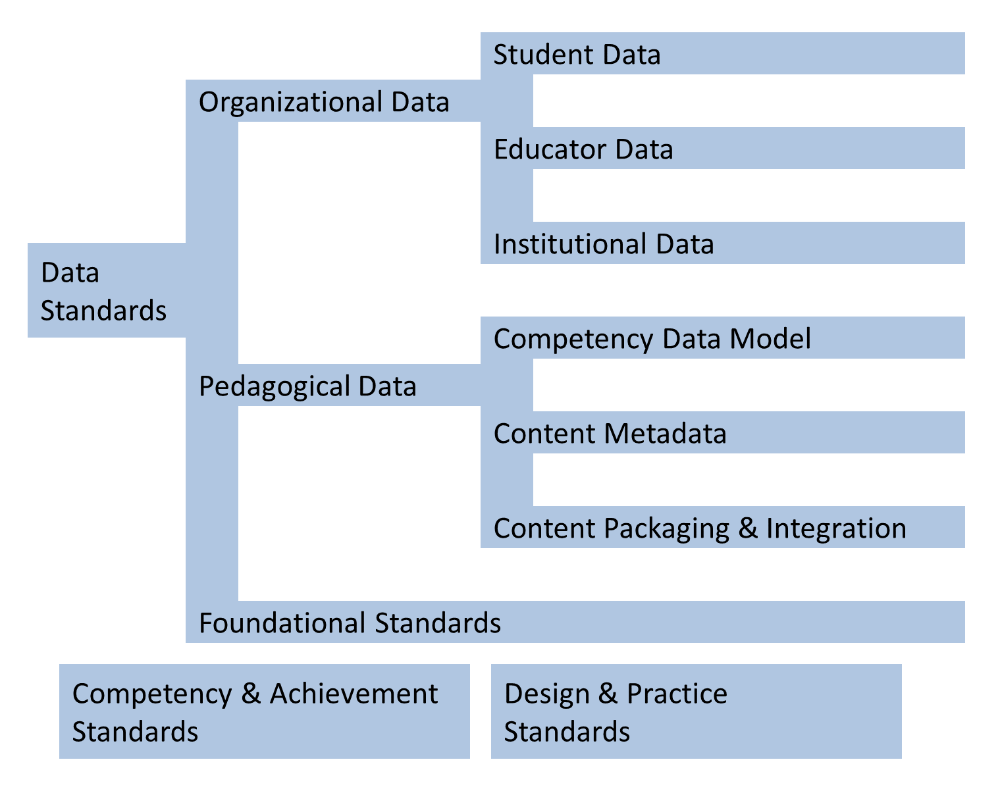
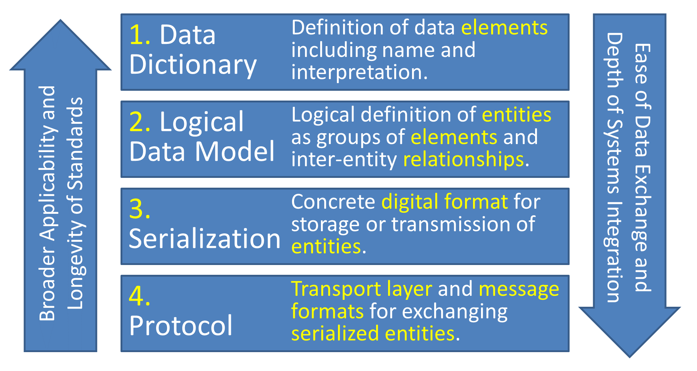

The [EdMatrix chart and table](/matrix.html) categorize education standards on two dimensions. Determining where standards are located on these dimensions helps understand which standards address similar needs and which are more complementary to each other.

* The vertical dimension of the matrix chart is "A Taxonomy of Educational Standards" that distinguishes between the *domains* or types of things each standard addresses.
* The horizontal dimension is "A Four-Layer Framework for Data Standards" indicating the data layers that are addressed by each standard.

## A Taxonomy of Educational Standards
{: #taxonomy }

There are three broad categories of standards that are involved in educational efforts: Data Standards, Competency & Achievement Standards, and Design & Practice Standards. The EdMatrix focuses primarily on the Data Standards but recognizes the importance and interconnectedness of the other standards categories.

**Data Standards** define the data elements and structures used to store and exchange educational information. For education, the three major domains of data standards are Organizational Data, Pedagogical Data and Foundational Standards. These three data domains are further divided into seven categories which are described later in this document.

**Competency & Achievement Standards** describe "what [a] learner will know or be able to do." (Adapted from [IMS CASE](/stds/IMS-CASE.html)). Achievement Standards are competency statements that have been defined and adopted by an organization or a government entity. For example, the U.S. 50 states have each defined achievement standards for grades K through 12. Many of the states have adopted the [Common Core State Standards](/stds/CCSSO-NGA-CCSS.html) for English Language Arts and Mathematics.

Competency frameworks appear all across academia and industry. In higher education, many universities define the *Learning Objectives* for each course of study. Professional associations like [IEEE](https://www.ieee.org/) and [ASCP](https://www.ascp.org) define the *Competency Standards* associated with their domain. Companies like Microsoft and CISCO define competencies required to be certified on their products.

**Design & Practice Standards** are the newest category in EdMatrix. These standards address human factors associated with learning experiences. For example [W3C WCAG](/stds/W3C-WCAG.html) standards address the accessibility of websites to those with disabilities. [Universal Design for Learning](/stds/CAST-UDL.html) focuses on known principles for optimizing teaching and learning. [FERPA](/stds/US-Government-FERPA.html) and [GDPR](https://en.wikipedia.org/wiki/General_Data_Protection_Regulation) address student privacy.

### Data Standards

The two main categories of educational data standards are organizational data and pedagogical data. The matrix also represents foundational standards that form the basis of most others.

**Organizational Data** standards focus on the students, educators and institutions involved in the educational process. This is where you find definitions for the records we keep about **students**, which learning experiences they have had, from which **educators**, and at which **learning institutions**.

**Pedagogical Data** standards focus on representing and transmitting learning resources. That overall category is divided into three subcategories:

* A **competency data model** is a data standard for representing *Competency & Achievement Standards* and other competency frameworks. The standards work together in this case. For example, [Next Generation Science Standards](/stds/Achieve-NGSS.html) are a set of *competency standards* defined by a consortium of U.S. states. They can be represented and transmitted in [CASE](/stds/IMS-CASE.html) format — a *competency data model standard*. [CTDL](/stds/Credential-Engine-CTDL.html) and [OBI](/stds/IMS-OBI.html) are two standards for representing *credential definitions* - the requirements to achieve a credential like a diploma, certificate, or badge.

* **Content Metadata** standards indicate how to describe educational content and learning resources. For example [LOM](/stds/IEEE-LTSC-LOM.html) and [LRMI](/stds/DublinCore-LRMI.html) define terms for name, author, educational level, and alignment to Competency and Achievement standards.

* **Content Packaging & Integration** standards indicate how to prepare and package digital learning resources to be used in learning platforms. Two standards, both from [IMS Global](https://www.imsglobal.org/), offer examples of contrasting approaches. [Common Cartridge](/stds/IMS-IMS-CC.html) describes how to package up learning resources, assessments, or whole courses to be transmitted and loaded into a Learning Management System (LMS). Meanwhile [LTI](/stds/IMS-LTI.html) describes how custom learning activities can be incorporated *by reference* into an LMS while they continue to be hosted on the provider's servers.

**Foundational Standards** are basic standards with broad applicability on which other standards are built. For example, [XML](/stds/W3C-XML.html) and [JSON](/stds/ECMA-JSON.html) are general standards for representing and transmitting data. LOM is based on XML while CASE is based on JSON. [HTTP](https://www.edmatrix.org/stds/IETF-HTTP.html) and [HTML](/stds/W3C-HTML.html) are the standards for communication and documents for the world-wide-web. [EDI](/stds/NIST-EDI.html) is an old but still commonly used protocol for transmitting structured documents between institutions.

## A Four-Layer Framework for Data Standards
{: #fourlayer }

There are four layers of work that fit together in a data design effort. Not all layers need to be present in a particular standard, but each layer must be addressed in a functional system.

1. **Data Dictionary:** This is a list of data *elements*; each with a title, definition, and sometimes a format. For example, Title: "Birth Date"; Definition: "Day an individual was born."; Format: "year-month-day".
2. **Logical Data Model:** Defines entities as collections of properties. Each property is an element in the data dictionary. In other words, an element becomes a property when it’s associated with an entity. The Logical Data Model also defines relationships between entities. For example, a Student entity might include the properties "name", "birthdate", "gender", "address", etc. The Student entity type would have a many to many relationship with the "Class" entity type.
3. **Serialization:**  This is a concrete format in which entities may be stored or exchanged. Two popular frameworks for serialization are XML and JSON but custom serializations are also common. There may be (and often are) multiple serializations of the same data model. Synonymous terms include "physical data model", "binary format", "marshaled format", "binding", "storage format", or "encoding".
4. **Protocol:**  The infrastructure over which the Serialized representations of Data Model Entities are accessed and exchanged. A typical protocol contains several sub-layers, hence the term "protocol stack." Typical sub-layers include Messaging Framework (e.g. Publish/Subscribe, Request/Response, Create/Read/Update/Delete, REST, SOAP, Enterprise Service Bus), Transport (e.g. HTTP or FTP) and Network (e.g. TCP/IP).

The task of systems integration becomes easier and less expensive as more layers are standardized. When all four layers are addressed, systems integration should be a matter of proper configuration settings with no custom programming required. On the other hand, standards (or portions thereof) that focus on the higher levels of the stack have broader applicability. For example, a principal benefit of a standardized Data Dictionary is reducing the risk that data may be interpreted differently by different systems. So, just standardizing the data dictionary achieves far-reaching benefits. Because of this, it’s important to clearly delineate between the layers even when a single standard or specification addresses more than one. 

## Synergies

I have often said that personalized learning happens at the intersection of student data and content data. That is, when you can match the data we have about the student's achievement against the data we have about the learning materials available to that student. In a broader sense, the benefits of standards are greatly multiplied when complementary standards are used together.

*This is an update to two previous documents, [A Four-Layer Framework for Data Standards](https://www.ofthat.com/2011/09/four-layer-framework-for-data-standards.html) and [A Taxonomy of Education Standards](https://www.ofthat.com/2013/03/a-taxonomy-of-education-standards.html). The two models were combined to produce EdMatrix.*