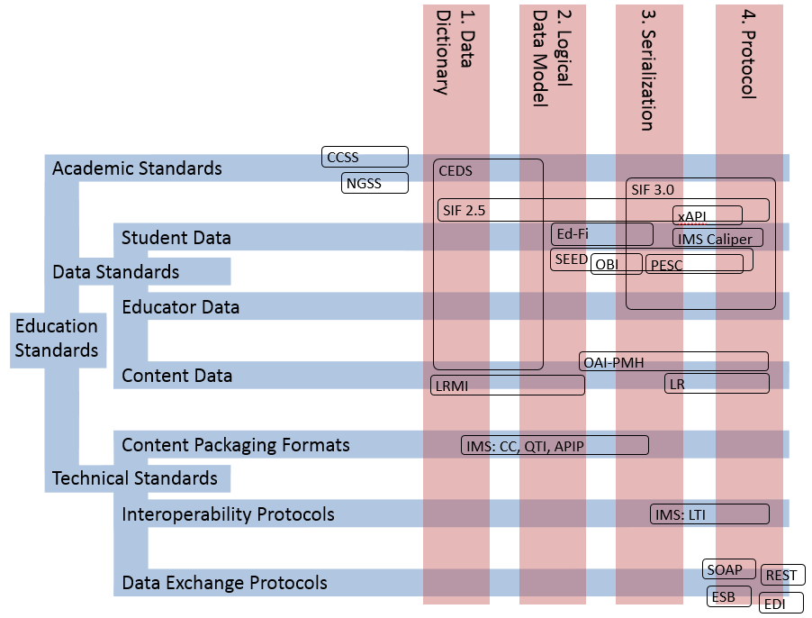

This matrix positions prominent Education Technology Standards on two dimensions. The horizontal dimension is the [Four Layer Framework for Data Standards](http://x.ofthat.com/papers/fourlayer.pdf). The vertical dimension is based on [A Taxonomy of Education Standards](http://www.ofthat.com/2013/03/a-taxonomy-of-education-standards.html). Positioning standards according these dimensions can help education technology vendors and consumers identify the standards that are relevant to their work.

Here are the names behind the abbreviations and links to the corresponding websites:

* CCSS: [Common Core State Standards](http://www.corestandards.org)
* CEDS: [Common Education Data Standards](http://ceds.ed.gov/)
* Ed-Fi: [Ed-Fi Alliance](http://www.ed-fi.org/)
* EDI: [Electronic Data Interchange](http://en.wikipedia.org/wiki/Electronic_data_interchange)
* ESB: [Enterprise Service Bus](http://en.wikipedia.org/wiki/Enterprise_service_bus)
* IMS CC: [IMS Common Cartridge](http://www.imsglobal.org/cc/)
* IMS LTI: [IMS Learning Tools Interoperability](http://www.imsglobal.org/lti/)
* IMS QTI: [IMS Question and Test Interoperability](http://www.imsglobal.org/question/)
* IMS Caliper: [IMS Caliper](http://www.imsglobal.org/activity/caliperram)
* LR: [Learning Registry](http://learningregistry.org/)
* LRMI: [Learning Resource Metadata Initiative](http://www.lrmi.net/)
* NGSS: [Next Generation Science Standards](http://www.nextgenscience.org/)
* OAI-PMH: [Open Archives Initiative Protocol for Metadata Harvesting](http://www.openarchives.org/pmh/)
* OBI: [Open Badge Infrastructure](http://openbadges.org/)
* PESC: [P20W Education Standards Council] - http://www.pesc.org/
* REST: [Representational State Transfer](http://en.wikipedia.org/wiki/Representational_state_transfer)
* SEED: [State Exchange of Education Data](http://www.ncpublicschools.org/data/seed/)
* SIF: [SIF Association](http://www.sifassociation.org)
* SOAP: [Simple Object Access Protocol](http://en.wikipedia.org/wiki/SOAP)
* xAPI: [Experience API](http://www.adlnet.gov/tla/experience-api/)

## Other Resources
* [SETDA: Transforming Data to Information in Service of Learning](http://www.setda.org/wp-content/uploads/2013/11/Data-to-Information.pdf)
* [OfThat: Data Standards in Service of Learning](http://www.ofthat.com/2013/06/data-standards-in-service-of-learning.html)